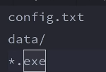

# Rangkuman video #12 GITIGNORE

## Creator

### Owen Tobias Sinurat / 19622270

&nbsp;

## Materi

- Gitignore merupakan file git dengan ekstensi .gitignore. File ini diisi dengan nama-nama file maupun folder yang ingin diabaikan atau tidak ikut di commmit bersama dengan file/folder lain saat mengeksekusi command "git add ." (memindahkan semua file/folder yang ada pada suatu folder yang dijadikan repo ke dalam staging area agar siap di commit). Berikut adalah contoh isi file gitignore, berurutan dari yang paling atas adalah nama file, nama folder, semua file dengan ekstensi .exe.

- Link list file/folder yang sebaiknya dimasukkan ke gitignore : github.com/github/gitignore atau gitignore.io
