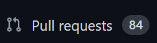

# Rangkuman video ke-4

## Creator

### Owen Tobias Sinurat / 19622270

&nbsp;

## Materi

- Fork / Forking
  - Membuat duplikat dari repository orang lain (beserta history-nya) tanpa mengubah repository aslinya
  - Jembatan antara repo original dan duplikatnya
  - Modifikasi terhadap repo original
  - Berkontribusi pada repo orang lain
  - Tidak sama dengan clone
  

&nbsp;

- Pull request
  - Merupakan command untuk memberikan perubahan terhadap repo kepada creator repo original.
  - Bisa ditolak maupun diterima oleh creator repo original.
  - Fitur ini sangat berguna untuk projek yang dikerjakan bersama oleh suatu tim.
  - Fitur ini juga membuat user github bisa saling membantu mengembangkan repo orang lain.

