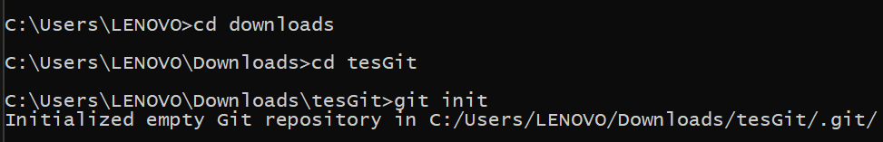
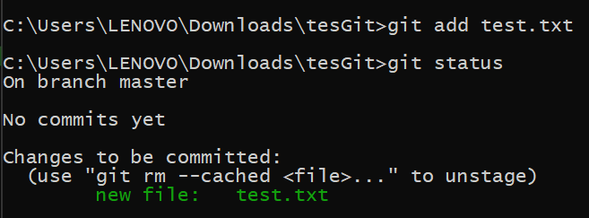
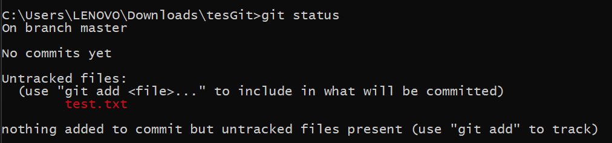
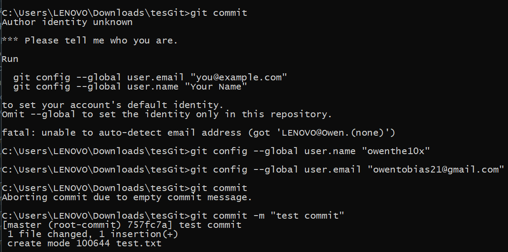
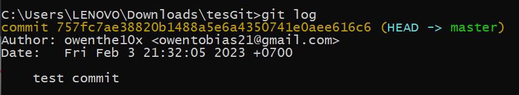

# Rangkuman video #5 BEKERJA DENGAN GIT

## Creator
### Owen Tobias Sinurat / 19622270

&nbsp;

## Materi
- Ada 3 area pada repo Git:
    - Working tree
        - tempat menyimpan file
    - Staging area
        - tempat menyimpan perubahan file menggunakan command git add
        - tersimpan ke dalam file dengan ekstensi .git
    - History
        - menyimpan perubahan di staging ke dalam history dengan commit
        - tersimpan ke dalam file dengan ekstensi .git

- Hal-hal yang ada di dalam file commit:
    - Nama
    - Email
    - Time stamp saat commit
    - Hash unik 40 digit sebagai identifier commit

&nbsp;

- Git init, command untuk menginisialisasi suatu folder pada directory lokal menjadi repository

- Git add, command untuk menambahkan file ke dalam staging area agar siap untuk di commit

- Git status, menampilkan status pada staging area

- Git commit, menambahkan perubahan ke branch atau 
main

- Git log, ini merupakan bagian history area dari repo Git, berisi rekam jejak semua yang pernah terjaid di repo tersebut.

