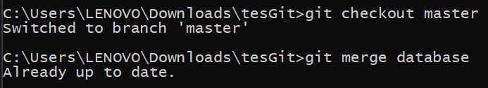

# Rangkuman video #6 GIT BRANCH & MERGE

## Creator

### Owen Tobias Sinurat / 19622270

&nbsp;

## Materi

- Jenis-jenis branch merge yaitu:
    - Fast Forward, branch yang ingin digabungkan berada di direct path 
    - Three-way Merge, branch yang ingin digabungkan tidak memiliki direct path

&nbsp;

- Git Branch, mengecek semua cabang pada commit tree.

- Git merge, menggabungkan 2 branch menjadi 1

- Git Checkout, mengganti branch yang sedang aktif

- Git Delete, menghapus branch, pada branch yang sudah di merge, disarankan untuk dihapus

